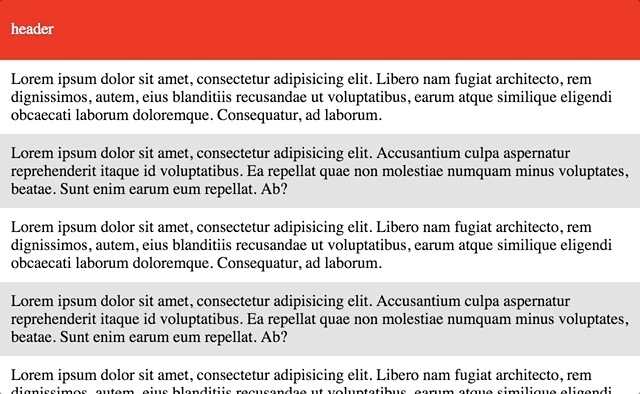

# Overflow color



Try it on your smartphone : [git.io/overflow](https://dimitrinicolas.github.io/overflow-color/) ([https://dimitrinicolas.github.io/overflow-color/](https://dimitrinicolas.github.io/overflow-color/))

A simple script that automatically switch CSS html background color according to scroll position.

This package is on npm
```console
$ npm i overflow-color
```

## Usage

You simply must add the script and the two attributes `data-oc-top` and `data-oc-bottom` to your body tag

```html
<body data-oc-top="red" data-oc-bottom="blue">
    <!-- ... -->
    <script src="overflow-color.min.js"></script>
</body>
```

You can use the shortcut `data-oc` by separating the two values with a comma

```html
<body data-oc="red,blue">
```

#### With a module bundler

You can import this package with a simple require or import

```javascript
require('overflow-color');
// with ES6+
import overflowColor from 'overflow-color';
```

## CSS tricks
#### Behind the Scenes

This library will wrap all the body content inside a `<div data-oc-wrap>`.
Then it set to the wrapper the same background as the body, and set body's background to `transparent`.

when the document is loaded:
```html
<head>
    <!-- ... -->
    <style>
        /* your style */
        body {
            background: lightgrey;
        }
    </style>
    <style>
        /* style added by the script */
        html { background: blue; }
    </style>
</head>
<body data-oc-top="red" data-oc-bottom="blue" style="background: transparent;">
    <div data-oc-wrap style="background: lightgrey;">
        <!-- ... -->
        <script src="overflow-color.min.js"></script>
    </div>
</body>
```

## Build

Minify script
```console
$ npm run build
```

## [License](LICENSE)
